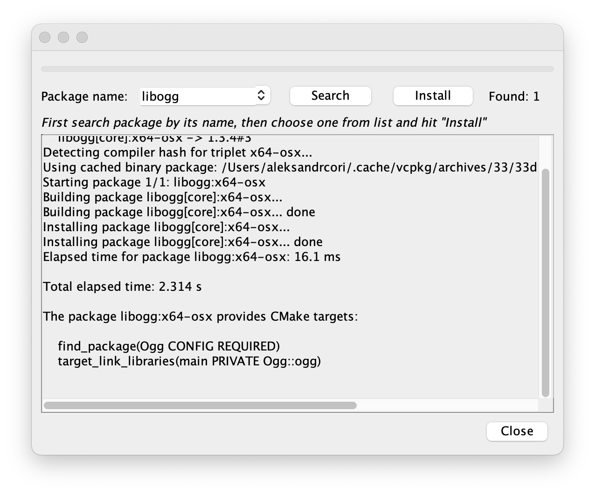

# vcpkg GUI

This is a graphical interface wrapper around 
[Microsoft `vcpkg` tool](https://github.com/microsoft/vcpkg).

App screenshots

## Usage

First, you have to provide a path for `vcpkg` executable.

Then you can manage your project packages: add or remove, using `+` 
and `-` buttons in the bottom of window.

You can search for dependency if you don't know its exact name. It is
the wrapper around `vcpkg search` command.

## Building

> Note: IntelliJ Swing GUI designer was used to generate forms, so 
> this project can compile stably only in IntelliJ IDEA 

In IntelliJ IDEA make sure you have an option **Build and run using**
in the section **Build, Execution, Deployment > Build Tools > Gradle** 
set to **IntelliJ IDEA**, not Gradle.

For some reason, Gradle doesn't know, how to generate forms from 
UI designer.

## Possible improvements

* Run package installation in the background (as it is implemented 
  in IntelliJ platform IDEs)
* Select project root different from `vcpkg` installation (this 
  feature is in beta in `vcpkg` itself)
